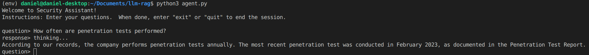

# About
The Security Assistant is an Ollama based large language model (LLM) retrieval-augmented generation (RAG) project that summarizes PDF and XLSX documents and responds to customer and auditor security questions.  Everything runs locally and does not rely on third party/online models.



# Why
Many organizations are sensitive to provide internal documentation to web based LLMs, such as ChatGPT, because of legal and privacy risks.  Therefore, a solution is needed to run a high quality on-premise LLM+RAG that does not rely on a third party to process data.  I was inspired to create an LLM that could use existing support documentation to answer security questions customers and/or auditors might have.  While the configured prompt is tailored to answering security questions, this project's prompts and files could be easily adjusted to be used for any LLM + RAG purpose.

# How it works
Langchain unstructured document parsers iterate through each document within the `files` folder, then chunks the content before inserting it into a local vector database using the `nomic-embed-text` model.

The agent runs two stages when asked a question using the Ollama3 model.  During the first stage, using only the content from the vector database, the agent analyzes available material based on the question and returns a few responses.  The second stage uses the output of the first stage to produce a final response.

# Requirements
- Tested on Debian and Ubuntu
- Storage: 25 GB
- CPU: 8 cores, w/o GPU will take ~5 min for LLM to respond
- GPU: optional, but 1000x faster
- Python3, pip, python3-venv (`apt install python3-venv`)

# Install
1. Setup python virtual env
```bash
python3 -m venv env
source env/bin/activate
```
2. Setup environment
```bash
chmod +x setup.sh
./setup.sh
```

# Setup
> Make sure you are in the Python Virtual Environment (`source env/bin/activate`)
1. Upload PDF, XLSX, CSV files to files folder
2. Create vector dababase
```bash
python3 vector.py
```

# Use
> Make sure you are in the Python Virtual Environment (`source env/bin/activate`)
1. Use the agent to ask questions
```bash
python3 agent.py
#ask your questions
#quit/exit to exit
```

# Notes
## Inspiration from:
1. https://www.youtube.com/watch?v=WfFpeBNfaeQ&list=PLB6yN0iA43p69t3613Q6i2pqq90Ps3ttb
2. https://github.com/tonykipkemboi/ollama_pdf_rag/tree/main

## References
1. https://github.com/hwchase17/chroma-langchain/blob/master/persistent-qa.ipynb
2. https://docs.aws.amazon.com/systems-manager/latest/userguide/walkthrough-cli.html
